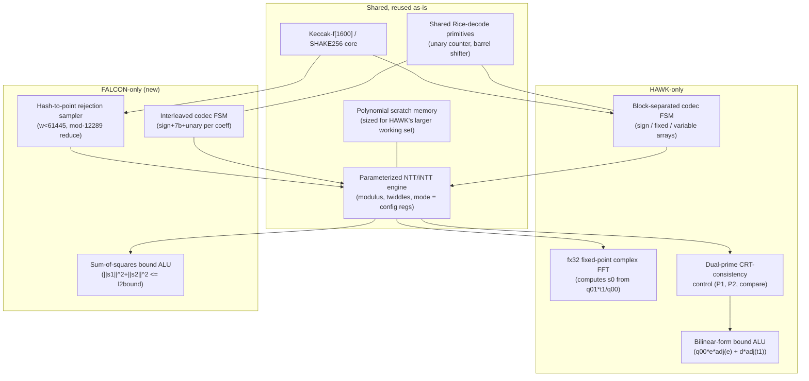

# HAWK ↔ FALCON Signature Verification: Mathematical, Algorithmic, and Hardware-Accelerator Comparison

**Scope.** This document compares the *verification* algorithms of HAWK
(`original/Additional-DS/HAWK/hawk-512`, `hawk-1024`) and FALCON
(`original/DS/FALCON/falcon-512`, `falcon-1024`) at three levels —
mathematical/theoretical, algorithmic, and source-level implementation —
to inform extending an existing HAWK-only hardware accelerator (Keccak +
NTT/iNTT) into a **crypto-agile** verifier supporting runtime selection
between:

- **scheme agility**: HAWK ↔ FALCON, and
- **security-level agility**: HAWK-512/1024, FALCON-512/1024,

for an automotive OTA firmware-update verifier. Keygen and signing are out
of scope — only the verify path is analyzed, since that is what an OTA
receiver actually executes in the field.

All source facts below are cited with `file:line`; every numeric constant
was independently re-verified by direct `grep`/`sed` against the actual
source tree in this repo (not reconstructed from memory of the HAWK/FALCON
specifications), so this document can be treated as ground truth for the
hardware redesign.

---

## 1. Mathematical and theoretical foundations

### 1.1 HAWK — Lattice Isomorphism Problem, ellipsoidal verification

HAWK's hardness assumption is the **Lattice Isomorphism Problem (LIP)**
over module lattices on the ring `R = Z[x]/(x^n+1)`, rather than the
NTRU/SIS assumption FALCON uses. Concretely, the secret key is a matrix
`B = [[f, F], [g, G]]` (short vectors `f, g` and their NTRU-equation
partners `F, G`, with `f·G - g·F = q`), and the **public key is the Gram
matrix of that basis**, not a single ring element:

```
Q = Bᵀ·B = [[q00, q01], [adj(q01), q11]]
q00 = f·adj(f) + g·adj(g)      (auto-adjoint, i.e. self-conjugate under x -> x^-1)
q01 = F·adj(f) + G·adj(g)
q11 = F·adj(F) + G·adj(G)
```

Only `(q00, q01)` are transmitted; `q11` is never needed by the verifier
(see §2.1, step 8) because the verification equation is re-derived
algebraically to eliminate it.

A HAWK signature on message `m` is a lattice point `(s0, s1)` such that,
writing `t = (t0, t1) = (h0, h1) - 2·(s0, s1)` for a hash-derived
"target" `(h0, h1)`, the signature is accepted iff the **quadratic form**
induced by the *secret basis's own Gram matrix* stays under a bound:

```
t · Q · tᵀ  =  q00·t0·adj(t0) + adj(q01)·t0·adj(t1) + q01·adj(t0)·t1 + q11·t1·adj(t1)   ≤  bound
```

This is an **ellipsoid membership test**: the acceptance region is an
n-dimensional ellipsoid whose shape is determined *per key* by `Q`
(i.e. by the actual secret basis geometry), not a sphere. This is the
mathematical heart of why HAWK verification needs more polynomial
arithmetic than FALCON's: evaluating a bilinear form in `Q` requires
multiplying `t0`/`t1` against `q00`/`q01` themselves (§2.1, §4), not just
computing a norm of a single recovered vector.

### 1.2 FALCON — NTRU lattice, GPV hash-and-sign, spherical verification

FALCON's hardness assumption is the hardness of finding short vectors in
an **NTRU lattice** built from a single ring element `h = g/f mod q`
(public key), following the Gentry–Peikert–Vaikuntanathan (GPV)
hash-and-sign paradigm with a fast-Fourier trapdoor sampler (irrelevant to
verify — only used by `sign.c`'s Klein/`ffSampling` routine). Verification
recomputes:

```
s1 = c - s2·h   (mod q, mod x^n+1)
```

where `c` is a hash-derived ring element ("hash-to-point") and `s2` is the
transmitted half of the signature, then checks a **plain Euclidean
(spherical) norm bound**:

```
‖s1‖² + ‖s2‖²  ≤  β²      (β² = l2bound[logn], a single scalar per degree)
```

This is a **ball membership test** against a fixed public radius, the
same for every key at a given degree — no key-dependent bilinear form is
evaluated. Mathematically this is strictly simpler: one ring
multiplication (`s2·h`), one subtraction, one sum-of-squares.

### 1.3 Why this distinction drives the hardware redesign

| | HAWK | FALCON |
|---|---|---|
| Public key | pair of ring elements (Gram matrix `q00,q01`) | single ring element `h` |
| Acceptance region | ellipsoid, **key-dependent shape** (`Q`) | sphere, **fixed radius** (`l2bound[logn]`) |
| Norm/bound evaluation | bilinear form: needs `q00`,`q01` multiplied against the recovered `t0`,`t1` | scalar sum of squares of `s1`,`s2` — no public-key polynomial re-multiplied into the bound |
| Ring multiplications needed per verify | several (§2.1/§4: `q01·t1`, then `q00·e·adj(e)`, `d·adj(t1)`, doubled over 2 primes) | essentially one (`s2·h`) |
| Extra transform needed | yes — a fixed-point complex FFT to compute `s0` (§2.1 step 4-6) | no |

This means a hardware NTT/iNTT engine *sized for HAWK's workload* has
comfortable headroom for FALCON (fewer transforms per verify), but the
accelerator needs new **capabilities**, not more raw NTT throughput, to
serve FALCON: modulus reconfigurability, a hash-to-point rejection
sampler, and a different (simpler) bound-check ALU. Details in §5.

---

## 2. Verification algorithm walk-throughs (source-grounded)

### 2.1 HAWK verify pipeline

Entry point `crypto_sign_open()` (`hawk-512/src/api.c:66`) →
`hawk_verify_finish` = `Zh(verify_finish)` (`hawk_vrfy.c:3772-3833`, a
decode-caching shim) → `Zh(verify_inner)` (`hawk_vrfy.c:2909-3768`, the
real algorithm):

1. **Decode signature** → `s1` (int16 poly) + `salt`, via Golomb-Rice
   `decode_gr_5_9`/`decode_gr_6_10` (§2.1 codec, §5.5).
2. **Hash pipeline (3 SHAKE256 sessions, §5.1)**:
   `hpub = SHAKE256(pub)` → `hm = SHAKE256(msg ‖ hpub)` →
   `h = SHAKE256(hm ‖ salt)`, producing raw bit-strings `h0`, `h1`
   (`n` bits each, `hawk_vrfy.c:3008-3030`).
3. **Form `t1 = h1 - 2·s1`**; enforce the "sym-break" canonical-form check
   on `t1` in the same pass (`hawk_vrfy.c:3050-3109`) — reject if it fails.
4. **Decode public key** `q00`, `q01` (Golomb-Rice, §5.5); reject if
   `q00[0] < 0` (`hawk_vrfy.c:3150-3152`).
5. **Fixed-point complex FFT** (`fx32_FFT`, `hawk_vrfy.c:1709`, its own
   32-bit fixed-point type — *not* the `fxr`/`vect_FFT` used by keygen):
   FFT `t1`, `q00`, `q01` (3 calls, `hawk_vrfy.c:3111,3197,3245`).
6. **Compute `z = (q01·t1)/q00`** in the frequency domain
   (`hawk_vrfy.c:3252-3415`), inverse-FFT it back (`fx32_iFFT`,
   `hawk_vrfy.c:3416`).
7. **Round `s0 = round(h0/2 + z)`**, range-check against `lims0`
   (`hawk_vrfy.c:3423-3488`); reject if out of range. Form
   `t0 = h0 - 2·s0`.
8. **Integer/NTT quadratic-form check, done twice** (mod `P1 = 2147473409`
   and mod `P2 = 2147389441`, both verified in source at
   `hawk_vrfy.c:667,672`): using `d = t1/q00`, `e = t0 + q01·d`, compute
   `n·sqnorm_Q(t) = Tr(q00·e·adj(e) + d·adj(t1))` entirely via NTT
   pointwise multiplies (`hawk_vrfy.c:3524-3749`). The two mod-`P1`/mod-`P2`
   results must agree (CRT-consistency, `hawk_vrfy.c:3739-3748`) — this is
   what proves the *true* integer norm fits under `P1·P2` (≈2^62) despite
   each NTT only being exact mod a 31-bit prime.
9. **Final accept test** (`hawk_vrfy.c:3767`):
   `(tnorm & (hn-1)) == 0  &&  (tnorm >> (logn-1)) <= max_tnorm`.

`max_tnorm` (floor(sigma_ver²·8·n), per-degree, `hawk_vrfy.c:2933-2951`):

| logn | n | salt (bytes) | max_tnorm |
|---|---|---|---|
| 8 | 256 | 14 | 2223 |
| **9** | **512** | **24** | **8317** |
| **10** | **1024** | **40** | **20218** |

`hawk-512` and `hawk-1024`'s `hawk_vrfy.c` are **byte-identical**
(confirmed via `diff`); the only difference between the two package
directories is `LOGN` (9 vs 10) in `api.c`. One algorithm, fully
parameterized by degree.

### 2.2 FALCON verify pipeline

Entry point `crypto_sign_open()` (`falcon-512/src/nist.c:189-264`):

1. **Decode public key `h`**: fixed 14-bit-per-coefficient unpack,
   `Zf(modq_decode)` (`codec.c:76-113`), range-checked (`w >= 12289` is
   rejected, `codec.c:103-105`).
2. **`h` → NTT/Montgomery domain once**: `Zf(to_ntt_monty)`
   (`vrfy.c:641-646`).
3. **Decode signature `s2`**: Golomb-Rice-like `Zf(comp_decode)`
   (`codec.c:404-473`) — 1 sign bit + 7-bit low part + unary high part,
   magnitude capped at ±2047.
4. **Hash-to-point (1 SHAKE256 session, §5.1)**:
   `inner_shake256_inject(nonce(40B) ‖ msg)` → flip →
   `Zf(hash_to_point_vartime)` (`common.c:35-67`) squeezes 2 bytes per
   coefficient, **rejection-samples**: accept `w` (16-bit) only if
   `w < 61445` (`= 5·12289`), then reduce `w mod 12289` by repeated
   subtraction (≤4 subtractions) — producing `c0`, uniform in `[0,12288]`.
5. **`verify_raw`** (`vrfy.c:649-694`): reduce `s2` mod q →
   `mq_NTT(s2)` → `mq_poly_montymul_ntt(s2, h)` (pointwise, NTT domain) →
   `mq_iNTT(...)` → `mq_poly_sub(·, c0)` → center-normalize into
   `[-q/2, q/2]`.
6. **`Zf(is_short)`** (`common.c:256-284`): `‖s1‖² + ‖s2‖² ≤ l2bound[logn]`.

`l2bound[logn]` (`common.c:241-253`, verified):

| logn | n | l2bound |
|---|---|---|
| **9** | **512** | **34034726** |
| **10** | **1024** | **70265242** |

`falcon-512` vs `falcon-1024`'s `vrfy.c`/`common.c` are algorithmically
identical (only `logn`, buffer-size, and header-byte literals differ in
`nist.c`/`api.h`) — again, one algorithm parameterized by degree.

---

## 3. Side-by-side parameter table

| | HAWK-512/1024 verify | FALCON-512/1024 verify |
|---|---|---|
| Ring | `Z[x]/(x^n+1)`, n=512/1024 | `Z[x]/(x^n+1)`, n=512/1024 |
| Public key shape | **pair** of polys `(q00, q01)` | **single** poly `h` |
| Working modulus/moduli | **two** 31-bit primes: `P1=2147473409`, `P2=2147389441` | **one** 14-bit prime: `q=12289` |
| Why 2 primes vs 1 | CRT-consistency needed to prove exact integer norm exceeds one 31-bit modulus' range | single-prime arithmetic suffices; bound check needs no exactness beyond mod q |
| NTT transforms per verify | ~6-10 (dual pass over `q00,q01,t1,e,d` × 2 primes) | ~2 (`NTT(s2)`, `iNTT(s2·h)`; `h`'s NTT is a one-time per-key cost) |
| Extra transform type | **fixed-point complex FFT** (`fx32`, 32-bit, HAWK-specific — not keygen's `fxr`) needed to compute `s0` | **none** — verify never touches floating/fixed-point FFT (confirmed: zero `fpr`/`fft` references in `vrfy.c`) |
| Bound check math | bilinear/quadratic form in key-dependent `Q` (ellipsoid) | scalar sum-of-squares vs fixed `l2bound[logn]` (sphere) |
| Hash construction | 3× SHAKE256 sessions producing **raw bit-strings** `h0,h1` (no modular reduction, no rejection sampling) | 1× SHAKE256 session, **hash-to-point with rejection sampling** mod 12289 |
| Signature codec | Golomb-Rice, **block-separated** layout (sign-bit array, then fixed-width array, then variable-length array) | Golomb-Rice-like, **per-coefficient interleaved** (sign+7-bit+unary per coefficient) |
| Public-key codec | Golomb-Rice (same family as signature codec) | fixed 14-bit-per-coefficient (no entropy coding) |
| Degree parameterization | single code path, `logn` runtime arg; `hawk-512`≡`hawk-1024` source | single code path, `logn` runtime arg; `falcon-512`≡`falcon-1024` source |

---

## 4. Software architecture comparison

Both reference implementations share the same high-level shape (thin
`crypto_sign_open` → decode → hash → arithmetic-core → bound-check), and
both isolate their NTT/modular-arithmetic engine into a handful of
self-contained functions with **no external dependency beyond the ring
degree**:

- HAWK: `hawk_vrfy.c` is **self-contained** — it does *not* reuse
  `ng_inner.h`'s `PRIMES[]`/multi-prime CRT machinery that keygen needs;
  it re-declares its own minimal 2-prime engine (`mp_add`, `mp_sub`,
  `mp_montymul`, `mp_NTT`, `mp_poly_to_NTT` — `hawk_vrfy.c:17-1067`).
  **This is good news for hardware reuse scoping**: verify's arithmetic
  needs are a small, fixed subset of what keygen needs, not the full
  multi-prime NTRU-solving datapath.
- FALCON: `vrfy.c` similarly self-contained, only includes `inner.h`; no
  `fpr.h`/`fft.h` dependency at all.

Both codecs (Golomb-Rice family) are *not* identical in bit-layout (HAWK
separates sign/fixed/variable arrays; FALCON interleaves per coefficient)
— a shared "generic Rice decoder" would need a configurable layout mode,
not just configurable Rice parameters (§5.5).

---

## 5. Hardware-accelerator implications, per subsystem

### 5.1 Keccak/SHAKE256 core — reusable, needs a new front-end for FALCON

The Keccak-f[1600] permutation itself is identical for both schemes (same
primitive, same rate/capacity for SHAKE256) — **no change needed to the
permutation core**. What differs:

- HAWK consumes SHAKE output as **raw bits** directly combined
  arithmetically (`t1 = h1 - 2·s1`) — no reduction, no rejection.
- FALCON needs a **rejection-sampling front-end** downstream of the
  squeeze output: 2 bytes → 16-bit word → compare `< 61445` → if
  accepted, conditional-subtract `12289` up to 4 times → else discard and
  squeeze again. This is small (one comparator + a 4-deep
  conditional-subtractor chain, no multiplier), but it is **new logic**
  the current HAWK-only accelerator does not have.
- Session/byte-count differences: HAWK does 3 SHAKE256 sessions per
  verify (pubkey hash, message hash, salt hash) vs FALCON's 1 (nonce+msg
  → hash-to-point); the control FSM must support both call patterns.

**Recommendation**: keep the Keccak core untouched; add a small,
independently-clock-gated rejection-sampling unit that sits between the
squeeze output and the coefficient-store, enabled only in FALCON mode.

### 5.2 NTT/iNTT engine — already generic; needs a domain-matched twiddle table, not an RTL change

**Update, post-implementation** (`tests/falcon1024-opt`/`falcon512-opt`
`vrfy.c`, see those READMEs' "NTT/iNTT hardware offload" sections): the
paragraph below as originally written got the required change wrong on two
points, corrected here after actually reading `ntt_engine.sv` and
`ng_mp31.c` rather than assuming from the RTL's absence of visible
per-scheme branching:

1. The engine does **not** need to be made parameterizable — it already
   is. `job_p_val_i`/`job_p0i_val_i` are plain per-job register inputs
   (`ntt_engine.sv`), and `ng_mp31.c`'s `mp_NTT_hw()` already passes `p`/
   `p0i` straight from its caller's arguments, "not just P1/P2" (that
   file's own header comment). **No RTL change was needed for FALCON's
   `q=12289` at all.**
2. The "dual-modulus CRT mode" was never an engine feature to begin with —
   it's a HAWK-side *software* convention (`hawk_vrfy.c` calling the
   single-modulus engine twice with different `(p,p0i)` and comparing).
   FALCON simply calls the same single-modulus engine once; no mode bit,
   no FSM change.

**What §5.2 as originally written failed to flag, and what actually
required new work**: the engine's Montgomery reduction is HAWK's own
`R=2^32` convention (`mp_montymul`, `ng_inner.h`). FALCON's own
`mq_montymul` (`vrfy.c`) is a *different*, bespoke `R=2^16` reduction
(`GMb`/`iGMb`/`R2=10952` are baked into that domain) — these two
Montgomery representations are numerically incompatible, so the engine
cannot be driven with FALCON's existing `GMb`/`iGMb`/`Q0I` directly.
Reuse required generating a **second, separate twiddle table**
(`GM32[]`/`iGM32[]`, `tests/falcon*-opt/vrfy.c`) for `q=12289` in the
engine's own `R=2^32` domain — via HAWK's own `mp_mkgmigm()` (`ng_mp31.c`,
unmodified), fed FALCON's own primitive root `g=7`/`1/g=8778`
(`vrfy.c:53-58`) re-encoded into that domain. This is host-side/software
work (a few hundred bytes of constant table), not hardware work, but it
is real new work the original write-up didn't scope. See the twiddle-table
paragraph immediately below for what *was* correctly anticipated (the
generator-based approach, just needed a target domain specified).

- **Twiddle-factor tables**: HAWK's software generates NTT twiddles at
  runtime from a generator element via repeated Montgomery
  multiplication (`mp_mkgm`/`mp_mkgmigm` pattern already used in keygen,
  `ng_mp31.c`) rather than shipping a full precomputed ROM — this
  generator-based approach is exactly what was reused for FALCON's
  `GM32[]`/`iGM32[]` above (generated once, on a host machine, and baked
  in as a `vrfy.c` constant table — not regenerated on-device per call,
  since `q=12289`/`g=7` never change).

### 5.3 HAWK-only fixed-point FFT (`fx32`) block — not reusable for FALCON

HAWK verify's `fx32_FFT`/`fx32_iFFT` (`hawk_vrfy.c:1709,1822`, a 32-bit
fixed-point complex FFT, distinct from keygen's `fxr`/`vect_FFT`) exists
solely to compute `s0` from `q01·t1/q00`. **FALCON verify never needs
this at all** (confirmed zero FFT/fpr references in `vrfy.c`). If the
current accelerator implements this as a dedicated block, it should
simply be **gated off / idle in FALCON mode** — there is no useful reuse
to extract here, and no FALCON-side requirement drives any change to it.
Worth flagging for area/power budgeting: this block is "dead weight" in
FALCON-only operation.

### 5.4 Entropy/codec decoder — shareable Rice-code core, but different layouts

Both codecs are Golomb-Rice-family, but:

- **HAWK**: block-separated — all sign bits first, then all fixed-width
  parts, then all variable-length (unary) parts, per polynomial
  (`hawk_vrfy.c` `decode_gr` family, parameterized `(low, lim_bits)` per
  polynomial type: `decode_gr_5_9`, `decode_gr_6_10`, `decode_gr_8_11`,
  `decode_gr_9_12`, `decode_gr_10_14`).
- **FALCON**: per-coefficient interleaved — sign bit + 7-bit low part +
  unary high part, one coefficient at a time (`codec.c:404-473`).

**Recommendation**: share the low-level primitives (trailing-zero/unary
bit counter, barrel shifter for fixed-width field extraction, sign-mask
XOR-combine) across a **configurable decoder core**, but implement the
block-vs-interleaved *layout* as two thin FSM front-ends over that shared
core, rather than trying to force one universal state machine — the data
dependency order differs enough (HAWK needs 3 full passes over the
coefficient array; FALCON needs 1) that unifying the FSM itself would add
complexity without saving area.

FALCON's public-key codec (`modq_decode`) needs **no entropy decoding at
all** — just fixed 14-bit unpacking + a range check. This is strictly
simpler than HAWK's public-key codec (which is also Golomb-Rice coded)
and can reuse the same barrel-shifter primitive with the Rice-decode path
disabled.

### 5.5 Public key / signature memory layout

- HAWK: public key = 2 polynomials (`q00` auto-adjoint half-size, `q01`
  full-size); working set per verify = `q00, q01, t0, t1, e, d` (6
  polynomials of degree n, some computed on the fly) × 2 (dual-prime
  pass, sequential not necessarily parallel).
- FALCON: public key = 1 polynomial (`h`, typically pre-transformed to
  NTT/Montgomery domain **once** at key-load and cached, `vrfy.c:641`);
  working set per verify = `h` (cached), `s2`, `c0`, `s1` (derived) — 3-4
  polynomials, single pass.

**Recommendation**: size on-chip polynomial scratch memory for HAWK's
larger working set (it's the superset); FALCON will simply use a fraction
of it. Consider caching the NTT-transformed `h` across multiple
verifications of the same OTA image chain (FALCON's `to_ntt_monty` is a
one-time per-key cost) — HAWK has no equivalent single-key caching
opportunity since `q00`/`q01` participate in the bound check itself, not
just a one-time transform.

### 5.6 Control/FSM — two orthogonal select axes

The datapath needs two independent configuration axes:

1. **Scheme select** (HAWK vs FALCON): picks modulus set (dual `P1,P2`
   31-bit vs single `q=12289` 14-bit), enables/disables the `fx32` FFT
   block, enables/disables the hash-to-point rejection sampler, selects
   codec layout (block-separated vs interleaved), selects bound-check ALU
   (bilinear-form accumulator vs sum-of-squares accumulator).
2. **Security-level select** (degree `n=512` vs `1024`, within either
   scheme): both reference implementations already parameterize purely by
   `logn` with no algorithmic divergence — this axis only affects table
   sizes (twiddle count, salt length, bound constant) and loop trip
   counts, not control logic. This is the "easy" axis; scheme select is
   the one requiring new hardware capability.

---

## 6. Proposed crypto-agile datapath (conceptual)



---

## 7. Security-level agility notes

- Both schemes are already **degree-parameterized in software** with no
  algorithmic divergence between their 512 and 1024 variants — the
  hardware only needs `logn`-indexed lookup tables (salt length,
  `max_tnorm`/`l2bound`, twiddle-table size), not separate control paths.
- FALCON's modulus `q=12289` is **the same for both degrees** (only `n`
  changes) — one fixed 14-bit Montgomery constant set suffices for both
  FALCON-512 and FALCON-1024.
- HAWK's `P1`/`P2` are likewise **degree-independent** (same two 31-bit
  primes for both hawk-512 and hawk-1024) — confirmed these are the same
  primes keygen's `PRIMES[0]`/`PRIMES[1]` use across all supported
  degrees (`ng_inner.h`/`ng_mp31.c`).
- Net effect: **4 security levels (HAWK-512/1024, FALCON-512/1024) need
  only 2 modulus configurations total** (the fixed HAWK dual-prime pair,
  and the fixed FALCON single prime), each reused across its two degrees
  — the accelerator's configuration-register surface is small.

---

## 8. Concrete delta checklist for the existing HAWK accelerator

| # | Change | Type | Rationale |
|---|---|---|---|
| 1 | ~~Make Montgomery modulus/`p0i`/`R2` configuration registers instead of hardwired `P1`/`P2`~~ **already true, no change needed** — `ntt_engine.sv`'s `job_p_val_i`/`job_p0i_val_i` are already plain per-job registers, confirmed by reading the RTL | **none** (was wrongly scoped as work) | verified against `ntt_engine.sv` directly, see §5.2 |
| 2 | ~~Add single-modulus NTT/iNTT mode~~ **already true, no change needed** — dual-prime CRT looping was always a HAWK-side software convention (`hawk_vrfy.c` calling the engine twice), never an engine feature; FALCON just calls it once | **none** (was wrongly scoped as work) | see §5.2 |
| 3 | Generate a **separate `q=12289` twiddle table in the engine's own x2^32-Montgomery domain** (`GM32[]`/`iGM32[]`, via HAWK's existing `mp_mkgmigm()`) — FALCON's native `GMb`/`iGMb` are in an incompatible x2^16 domain and cannot be pointed at the engine directly | **new constant data**, host-side only, not hardware | domain mismatch not identified in the original write-up — see §5.2. **Done**: `tests/falcon1024-opt`/`falcon512-opt` `vrfy.c` (`mq_NTT_hw`/`mq_iNTT_hw`), cross-checked against native `mq_NTT`/`mq_iNTT` (400 trials, x86 harness) and compiles clean with `riscv-none-elf-gcc`; **not yet run on the RTL simulator**. |
| 4 | Add hash-to-point rejection-sampling unit (`w<61445` compare + conditional-subtract mod 12289) downstream of Keccak squeeze | **new** | FALCON-only requirement, not present for HAWK |
| 5 | Add sum-of-squares bound-check ALU (accumulate `s1²+s2²`, compare to `l2bound[logn]`) | **new**, small | FALCON's bound check is much simpler than HAWK's bilinear form |
| 6 | Add interleaved-layout Rice-decoder FSM (reusing existing unary/barrel-shift primitives) | new FSM, shared datapath | FALCON codec layout differs from HAWK's |
| 7 | Add fixed 14-bit unpack + range-check path for FALCON public-key decode | small, new | simpler than HAWK's Golomb-Rice pubkey codec |
| 8 | Gate off (don't modify) the `fx32` fixed-point FFT block in FALCON mode | no change, just a mode-disable | FALCON verify never uses it |
| 9 | Add scheme-select control register driving all of the above muxes/enables | new | top-level agility switch |
| 10 | Confirm scratch-memory sizing already covers HAWK's larger working set (6 polys) so FALCON (3-4 polys) fits without new allocation | verify, likely no change | HAWK is the superset case |

---

## Appendix — key source citations

- HAWK verify entry: `original/Additional-DS/HAWK/hawk-512/src/api.c:66`,
  `hawk_vrfy.c:2909` (`Zh(verify_inner)`), `hawk_vrfy.c:3772`
  (`Zh(verify_finish)`).
- HAWK moduli: `hawk_vrfy.c:667` (`P1=2147473409`), `hawk_vrfy.c:672`
  (`P2=2147389441`).
- HAWK bound table: `hawk_vrfy.c:2933-2951`.
- HAWK fixed-point FFT: `hawk_vrfy.c:1709` (`fx32_FFT`), `hawk_vrfy.c:1822`
  (`fx32_iFFT`).
- HAWK codec: `hawk_vrfy.c:2521-2652` (`decode_gr` family), `2653-2772`
  (`decode_q00`/`decode_q01`/`decode_s1`).
- FALCON verify entry: `original/DS/FALCON/falcon-512/src/nist.c:189-264`.
- FALCON modulus: `vrfy.c:48-51` (`Q=12289`, `Q0I=12287`, `R=4091`,
  `R2=10952`).
- FALCON bound table: `common.c:241-253` (`l2bound[]`).
- FALCON hash-to-point: `common.c:35-67` (`Zf(hash_to_point_vartime)`,
  rejection at `w < 61445 = 5*12289`).
- FALCON codec: `codec.c:35-113` (`modq_encode`/`decode`), `codec.c:307-473`
  (`comp_encode`/`decode`).

All of the above were directly re-verified by `grep`/`sed` against this
repo's source at the time of writing, not taken on faith from subagent
summaries or general scheme-paper knowledge.
