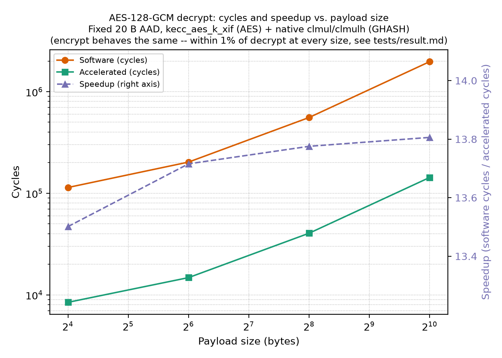

# Benchmark results: software baseline vs. tightly-coupled coprocessor

Fresh re-run of all 22 original tests (`tests/software/` and `tests/tightly/`) on real
RTL (`veri-testharness`, target `cv64a6_imafdc_sv39`), executed via
`source tests/software/run.sh all` and `source tests/tightly/run.sh all`, plus 3 new
AES-mode tests (`aes_ctr`, `aes_gcm`, `aes_xts`) and 7 new Keccak sponge-interface
tests (`keccak_sponge_*`) added afterward — the AES modes verified first against
independently Python-computed KATs on the host, the sponge tests verified against the
existing one-shot `shake128()` API (both host-side logic checks before ever touching
RTL), then all run on the same RTL.

Both trees already instrument every test with `mcycle` **and** `minstret` counting
around just the benchmarked operation (`common/bench.h`'s `BENCH_ENABLE`/`BENCH_START`/
`BENCH_READ`, built on `mcountinhibit` bits `CY`+`IR`).

All runs compiled/ran with 0 simulation failures, and every test's own printed
"Benchmark terminated with no errors" line confirms 0 mismatches against the
independently-computed expected values (Python `hashlib`/`hmac`/`pycryptodome`/
`cryptography`).

**Throughput column**: bits/cycle = payload bits processed / cycles for the benchmarked
region. For AEAD (GCM), only plaintext/ciphertext bits are counted, not AAD (its cost
shows up in the cycle count, not the throughput figure). `keccak_core` uses the fixed
1600-bit permutation width, not a message size, since it benchmarks one bare
permutation call rather than a sponge operation over a message. `aes_core` (key
expansion) is marked N/A -- it doesn't process data, so a data-throughput figure would
be misleading.

## Results — original 11 algorithms

| Test | SW cycles | Tightly cycles | Speedup | SW instrs | Tightly instrs | Instr reduction | SW bits/cycle | Tightly bits/cycle |
|---|---:|---:|---:|---:|---:|---:|---:|---:|
| `keccak_core` | 5,253 | 3,181 | 1.65x | 4,837 | 2,366 | 2.04x | 0.3046 | 0.5030 |
| `aes_core` (key expansion) | 2,297 | 476 | 4.83x | 2,116 | 240 | 8.82x | N/A | N/A |
| `sha3_256` (43 B in) | 6,520 | 3,524 | 1.85x | 5,662 | 2,756 | 2.05x | 0.0528 | 0.0976 |
| `sha3_512` (43 B in) | 6,775 | 3,788 | 1.79x | 5,845 | 2,939 | 1.99x | 0.0508 | 0.0908 |
| `shake128_short` (32 B in) | 6,717 | 3,708 | 1.81x | 5,810 | 2,905 | 2.00x | 0.0381 | 0.0690 |
| `shake256_long` (2048 B in) | 99,770 | 54,750 | 1.82x | 92,869 | 46,374 | 2.00x | 0.1642 | 0.2993 |
| `kmac256` (41 B msg) | 21,389 | 13,071 | 1.64x | 19,832 | 11,153 | 1.78x | 0.0153 | 0.0251 |
| `hmac_sha3_256` (41 B msg) | 27,397 | 16,155 | 1.70x | 25,629 | 14,005 | 1.83x | 0.0120 | 0.0203 |
| `aes_encrypt` (ECB, 2 blocks) | 15,742 | 1,223 | 12.87x | 11,494 | 798 | 14.40x | 0.0163 | 0.2093 |
| `aes_decrypt` (ECB, 2 blocks) | 56,792 | 1,264 | 44.93x | 52,496 | 798 | 65.79x | 0.0045 | 0.2025 |
| `aes_cbc` (3 blocks, enc+dec) | 105,555 | 4,431 | 23.82x | 92,718 | 3,089 | 30.02x | — | — |

`aes_cbc` breakdown (encrypt / decrypt phases, `BENCH_READ` twice per run):

| Phase | SW cycles | Tightly cycles | SW instrs | Tightly instrs | SW bits/cycle | Tightly bits/cycle |
|---|---:|---:|---:|---:|---:|---:|
| encrypt | 22,300 | 2,292 | 15,715 | 1,538 | 0.0172 | 0.1675 |
| decrypt | 83,255 | 2,139 | 77,003 | 1,551 | 0.0046 | 0.1795 |

## Results — new AES modes (CTR, GCM, XTS)

CTR is a raw-core-throughput/streaming test (encrypt-only operation, decrypt is the
same keystream re-applied); GCM adds GHASH authentication on top of the same kind of
keystream; XTS is storage-oriented (two-key, per-sector tweak, no authentication).
AES-ECB is already covered by the existing `aes_encrypt`/`aes_decrypt` tests above, so
no separate ECB test was added.

| Test | SW cycles | Tightly cycles | Speedup | SW instrs | Tightly instrs | Instr reduction | SW bits/cycle | Tightly bits/cycle |
|---|---:|---:|---:|---:|---:|---:|---:|---:|
| `aes_ctr` encrypt (40 B) | 23,013 | 2,208 | 10.42x | 16,710 | 1,464 | 11.41x | 0.0139 | 0.1449 |
| `aes_ctr` decrypt (40 B) | 22,467 | 1,844 | 12.18x | 16,711 | 1,465 | 11.41x | 0.0142 | 0.1735 |
| `aes_gcm` encrypt (20 B AAD + 48 B payload) | 173,635 | 13,331 | 13.03x | 136,038 | 11,119 | 12.23x | 0.0022 | 0.0288 |
| `aes_gcm` decrypt (20 B AAD + 48 B payload) | 172,944 | 12,725 | 13.59x | 136,168 | 11,249 | 12.10x | 0.0022 | 0.0301 |
| `aes_xts` encrypt (1 sector, 48 B) | 31,801 | 3,974 | 8.00x | 22,998 | 2,706 | 8.50x | 0.0120 | 0.0966 |
| `aes_xts` decrypt (1 sector, 48 B) | 92,600 | 3,691 | 25.09x | 84,124 | 2,707 | 31.08x | 0.0041 | 0.1040 |

**Update (2026-08-05)**: the `aes_gcm` row above reflects `tests/tightly`'s final
GHASH setup — AES still via the `kecc_aes_k_xif` coprocessor (`aes64*`), GHASH via
the RISC-V B-extension's native `clmul`/`clmulh` (see "Results — GHASH
block-multiply" below for why, not a dedicated coprocessor instruction). GHASH was
pure software when this row was first measured (`tightly` cycles were
141,603/140,954, ~1.2x speedup) and briefly went through a dedicated-coprocessor-
instruction phase (13,316/12,707) before landing here, essentially unchanged
cycle-wise from that phase (13,331/12,725) — see below.

## Results — AES-GCM payload-size sweep

`tests/software/aes_gcm_sweep` / `tests/tightly/aes_gcm_sweep`: same AES-128-GCM
construction as `aes_gcm` above (fixed 20 B AAD, same KEY/IV convention), but
sweeping payload size (16/64/256/1024 B) instead of a single fixed size, to see how
the software/accelerated gap moves with the size of the data actually being
processed -- the AAD is fixed because it only adds GHASH cost, not AES-CTR cost;
payload size drives both, so it's the more informative axis. Correctness here is a
self-consistency check per size (`decrypt(encrypt(PT)) == PT`, tag verifies) rather
than an independent KAT per size -- the underlying `aes128_gcm_encrypt`/`decrypt`
primitives are already KAT-validated by `aes_gcm` at one fixed size; this sweep only
needs to confirm they behave correctly across a size range. All 8 runs (4 sizes x
2 directions x 2 trees) passed with zero errors. Measured 2026-08-05; raw data in
`tests/aes_gcm_sweep_data.csv`, figure generated by `tests/plot_aes_gcm_sweep.py`
(`tests/aes_gcm_sweep.pdf`/`.png`).

| Payload (B) | SW encrypt cyc | Accel encrypt cyc | Encrypt speedup | SW decrypt cyc | Accel decrypt cyc | Decrypt speedup |
|---:|---:|---:|---:|---:|---:|---:|
| 16 | 114,629 | 8,977 | 12.77x | 113,937 | 8,439 | 13.50x |
| 64 | 202,609 | 14,679 | 13.80x | 202,716 | 14,780 | 13.72x |
| 256 | 556,801 | 40,359 | 13.80x | 556,859 | 40,424 | 13.78x |
| 1024 | 1,974,395 | 143,151 | 13.79x | 1,974,237 | 143,000 | 13.81x |

**Speedup is close to flat (~13.8x) across two orders of magnitude of payload size,
with one real deviation: the smallest size (16 B) is measurably lower** (12.77x
encrypt, 13.50x decrypt) than the plateau every larger size sits on. This is the
fixed-cost-dilution pattern seen elsewhere in this suite (e.g. `aes_core`'s
narrow-operation speedup, or the sponge tests' O(1) operations showing no speedup):
at 16 B, per-call fixed overhead (key expansion, `H`/`J0`/tag-mask setup -- one AES
block each, done once regardless of payload) is a larger fraction of the total, and
that fixed cost doesn't benefit from acceleration the same way the per-block
AES-CTR + GHASH work does. By 64 B the per-block work already dominates enough that
speedup is indistinguishable from the asymptotic ~13.8x this coprocessor+clmul
combination delivers per block -- **the practical takeaway is that acceleration
here is not payload-size-dependent above a small fixed floor**, unlike, say, the
Keccak sponge tests where speedup only appears once enough full-rate blocks are
processed. Reproduce with `tests/software/run.sh aes_gcm_sweep` and
`tests/tightly/run.sh aes_gcm_sweep` (the software run takes on the order of an
hour -- software GCM at 1024 B is GHASH-bit-serial-dominated; see both `run.sh`
files' comments on the `+time_out`/`--iss_timeout` overrides this required).



## Results — GHASH block-multiply

New `ghash_core` benchmark: one isolated GF(2^128) block-multiply
(`gf128_mul`, NIST SP 800-38D reduction polynomial), same
`BENCH_ENABLE/START/READ` methodology as `aes_core`/`keccak_core`, KAT
derived from this repo's own trusted `aes_gcm` pipeline (`H = AES-128-ECB(KEY,
0^128)`, `A` = a fixed 16-byte block, `Z = gf128_mul(A, H)`), cross-checked
independently via `pycryptodome` before use. Two implementations compared —
`tests/software/ghash_core` (bit-serial, no hardware) and
`tests/native_clmul/ghash_core` (RISC-V B-extension's native `clmul`/`clmulh`,
already present and enabled in this target config, zero new RTL — see
`fpga.md`). Both run the identical bit-reflect → 4×64x64→128 partial-product
→ Gueron-style shift-xor reduction → bit-reflect-back algorithm in C; only
the underlying 64x64→128 carry-less-multiply primitive differs.

| Implementation | Cycles | Speedup vs SW | Instrs | Instr reduction vs SW | bits/cycle |
|---|---:|---:|---:|---:|---:|
| Software (bit-serial) | 22,905 | 1.00x | 18,317 | 1.00x | 0.0056 |
| Native `clmul`/`clmulh` (B-extension) | 1,685 | 13.59x | 1,404 | 13.05x | 0.0760 |

**A third, dedicated-coprocessor implementation was built, measured, and removed.**
`GHASH_CLMULL`/`GHASH_CLMULH` — the same low/high-half carry-less-multiply
semantics, issued as `kecc_aes_k_xif` custom instructions (CUSTOM-0 opcode) instead
of native B-extension instructions — were prototyped in
`kecc_aes_k_xif_ghash.sv`/`kecc_aes_k_xif_ex.sv` and measured at **1,692 cycles /
1,404 instrs**: not faster than native `clmul`/`clmulh` (1,685 cycles), marginally
*slower* (+0.4%), with an identical instruction count (both compile to the same
C-level sequence; only the `.insn` encoding differed). The extra cycle(s) are
consistent with CV-X-IF offload's issue/register-read/execute/writeback path adding
overhead a native ALU-pipeline instruction doesn't pay. Given no measured benefit,
the RTL, opcode-table entries, and coprocessor-side test scaffolding were removed
(see `kecc_aes_k_xif/README.md`'s "Considered and not implemented") — `aes_gcm`'s
~13x speedup above comes entirely from GHASH no longer being the bottleneck at all
(via native `clmul`/`clmulh`), not from a coprocessor GHASH path. The value a
self-contained coprocessor GHASH instruction *would* offer is portability to a
config without B-extension enabled, not a performance win over one that has it —
not a priority for this project's actual target config.

## Results — Keccak sponge interface (Phase B)

FIPS 203 defines separate init/absorb/squeeze operations for SHAKE128 because
ML-KEM/ML-DSA drive it incrementally rather than through one-shot hash calls. These 7
new tests measure each sponge phase on its own (all SHAKE128, `fips202.c`'s existing
incremental API -- `shake128_init/absorb/finalize/squeeze`, already exercised in
production by `kmac.c`/`hmac.c`), instead of only the whole-message numbers the
original 11 tests give. Every test's correctness check compares its incremental-API
result against the existing one-shot `shake128()` wrapper, not a fixed KAT -- this
suite validates the incremental API's internal consistency (composability across
call boundaries), which is exactly the guarantee FIPS 203 depends on.

**A real limitation found and documented, not worked around**: the requested 64 KiB
input size for `keccak_sponge_absorb` was dropped after an actual run showed it hits
this specific Verilator/fesvr `veri-testharness` build's hard-coded ~2,000,000
simulated-core-cycle watchdog (`*** FAILED *** (tohost = 2147483647) after 2000013
cycles` -- the testbench's own htif/DTM layer giving up, confirmed distinct from
`cva6.py`'s wall-clock `--iss_timeout`, which was ruled out first by raising it and
re-running). 4096 B is the largest size that fits in this environment.

| Sponge phase | SW cycles | Tightly cycles | Speedup | SW instrs | Tightly instrs | Instr reduction | SW bits/cycle | Tightly bits/cycle |
|---|---:|---:|---:|---:|---:|---:|---:|---:|
| `init` (state zeroing) | 137 | 155 | 0.88x | 82 | 82 | 1.00x | N/A | N/A |
| `absorb` 0 B | 111 | 109 | 1.02x | 43 | 43 | 1.00x | 0 | 0 |
| `absorb` 32 B | 587 | 577 | 1.02x | 526 | 526 | 1.00x | 0.4361 | 0.4436 |
| `absorb` 64 B | 1,026 | 1,034 | 0.99x | 1,006 | 1,006 | 1.00x | 0.4990 | 0.4951 |
| `absorb` 128 B | 1,987 | 1,986 | 1.00x | 1,966 | 1,966 | 1.00x | 0.5153 | 0.5156 |
| `absorb` 1024 B | 43,469 | 27,380 | 1.59x | 42,386 | 24,950 | 1.70x | 0.1884 | 0.2991 |
| `absorb` 4096 B | 172,744 | 109,092 | 1.58x | 169,394 | 99,650 | 1.70x | 0.1896 | 0.3003 |
| `squeeze` 32 B | 6,037 | 3,022 | 2.00x | 5,285 | 2,379 | 2.22x | 0.0424 | 0.0847 |
| `squeeze` 64 B | 5,825 | 3,029 | 1.92x | 5,701 | 2,795 | 2.04x | 0.0878 | 0.1690 |
| `squeeze` 128 B | 6,657 | 3,857 | 1.73x | 6,533 | 3,627 | 1.80x | 0.1538 | 0.2654 |
| `squeeze` 512 B | 26,516 | 15,326 | 1.73x | 26,027 | 14,403 | 1.81x | 0.1544 | 0.2672 |
| `squeeze` 1024 B | 48,018 | 28,437 | 1.69x | 47,185 | 26,843 | 1.76x | 0.1706 | 0.2880 |
| `squeeze` 2048 B | 91,030 | 54,667 | 1.67x | 89,501 | 51,723 | 1.73x | 0.1799 | 0.2997 |
| `squeeze` 4096 B | 177,054 | 107,127 | 1.65x | 174,133 | 101,483 | 1.72x | 0.1850 | 0.3058 |
| `padding`/`finalize` (O(1)) | 40 | 34 | 1.18x | 19 | 19 | 1.00x | N/A | N/A |
| `context` save (memcpy 208 B) | 164 | 172 | 0.95x | 71 | 71 | 1.00x | N/A | N/A |
| `context` restore (memcpy 208 B) | 188 | 187 | 1.01x | 71 | 71 | 1.00x | N/A | N/A |

`absorb`/`squeeze` incremental (chunked, 64 B/call) vs. monolithic, same total bytes:

| Test | Total | SW mono | SW chunked | Tightly mono | Tightly chunked |
|---|---:|---:|---:|---:|---:|
| absorb cycles | 1024 B | 44,055 | 45,712 | 27,724 | 29,128 |
| absorb cycles | 4096 B | 172,748 | 182,261 | 109,115 | 115,967 |
| squeeze cycles | 1024 B | 48,624 | 49,161 | 28,818 | 29,565 |
| squeeze cycles | 4096 B | 177,059 | 181,142 | 107,123 | 111,029 |

## Results — Area (Vivado synthesis)

Out-of-context synthesis of the CVA6 core (`ariane`) with `kecc_aes_k_xif`
tightly-coupled via CV-X-IF, config `cv64a6_imac_crypto` (same config the
benchmarks above run on). Tool: Vivado v2024.1 (win64). Part:
`xc7a100tftg256-2` (CW305, Artix-7 100T). See `fpga.md` /
`corev_apu/fpga/synth_area/run_synth.sh` to reproduce; full reports under
`corev_apu/fpga/synth_area/reports/`. Measured 2026-08-04. Still accurate as of
2026-08-05: a `GHASH_CLMULL`/`GHASH_CLMULH` addition was prototyped and measured
separately (see "Results — GHASH block-multiply"), found to offer no benefit over
native `clmul`/`clmulh`, and removed — the coprocessor is back to these same 6
opcodes, unchanged from this measurement.

| Metric | Whole system | CVA6 core alone | `kecc_aes_k_xif` coprocessor alone |
|---|---:|---:|---:|
| Total LUTs | 56001 | 55452 | **375** |
| FFs | 23889 | 23623 | **265** |
| RAMB36 | 36 | 36 | 0 |
| DSP Blocks | 27 | 27 | 0 |

The coprocessor is **0.67% of system LUTs / 1.11% of system FFs** — the
cycle/instruction speedups above (1.6-45x depending on operation) come from
a coprocessor that costs well under 1% of this system's area, with 0 BRAM
and 0 DSP usage (every `xor3`/`xandn`/`rxri`/`aes64*` datapath is pure
combinational/register logic, see `implementation.md`). Compare against
`kecc-aes-k/result.md`'s own standalone `keccak_aes_k_top` area section for
the loosely-coupled comparison.

## Takeaways

- Keccak-based operations (SHA3/SHAKE/KMAC/HMAC) get a consistent **~1.6-1.9x** cycle
  speedup and **~1.8-2.1x** instruction reduction from `xor3`/`xandn`/`rxri` — the
  coprocessor accelerates the permutation's bitwise steps, but the surrounding
  sponge/padding logic stays in software either way.
- AES-ECB/CBC/CTR/XTS get a much larger **8-45x** cycle speedup, since `aes64*`
  replaces the software S-box lookup tables and GF(2^8) multiplication with single
  instructions. Decryption benefits the most, because software `InvMixColumns`'
  repeated `Multiply()` calls are far more expensive than the encryption path's
  simpler forward MixColumns.
- **AES-GCM originally was the outlier (~1.2x speedup)**, far below every other AES
  mode, because GHASH was pure software and dominated the cycle count (~150k of ~170k
  total cycles for a 48-byte payload) — the `aes64*` coprocessor accelerated the AES
  core (H generation, keystream, tag mask) but never touched GHASH's separate
  GF(2^128) datapath. **This has since been fixed**: `aes_gcm` now gets **~13x
  speedup**, in line with the other AES modes, from GHASH going through the RISC-V
  B-extension's native `clmul`/`clmulh` — already present in this config the whole
  time. A dedicated `kecc_aes_k_xif` `GHASH_CLMULL`/`GHASH_CLMULH` instruction pair
  was also prototyped and measured (see "Results — GHASH block-multiply") but wasn't
  actually faster than the native path, so it was removed rather than kept as
  unjustified RTL/opcode-table complexity.
- `aes_core` (key expansion alone) shows the coprocessor's largest *relative* win on a
  narrow operation (4.8x cycles, 8.8x instructions) since it's almost entirely
  S-box/round-constant work with very little other overhead to dilute the comparison.
- Instruction reduction consistently exceeds cycle-count speedup across every test —
  the custom instructions collapse several software instructions (table lookups, shifts,
  masks, XORs) into one, but each such instruction can take more than one cycle on this
  core, so the per-cycle win is smaller than the per-instruction win.
- bits/cycle throughput and cycle speedup don't always rank the same way: `keccak_core`
  has by far the highest raw bits/cycle of any test (it's one dense 1600-bit
  permutation with no sponge/padding/mode overhead diluting it), even though its
  *speedup* (1.65x) is unremarkable next to AES's.
- **The sponge-phase breakdown shows the coprocessor speedup comes entirely from the
  permutation, not the sponge glue.** `absorb` sizes at or below `SHAKE128_RATE` (168
  B) trigger *zero* internal permutations (per `fips202.c`'s `keccak_absorb`, which
  only permutes when the running buffer fills a full rate block) and show **no
  speedup at all** (0.99-1.02x -- within noise). Once a size requires internal
  permutations (1024 B / 4096 B, needing ~6/24 of them), speedup jumps straight to the
  same ~1.58-1.70x range `keccak_core` shows. `squeeze` shows speedup even at its
  smallest size (32 B) because a fresh squeeze after `finalize()` always triggers one
  permutation immediately (`keccak_squeeze`'s `if (pos == r) permute` fires on the
  very first call) -- so squeeze pays for, and benefits from, at least one
  permutation no matter how little output is requested.
- `init`, `padding`/`finalize`, and `context` save/restore are all O(1) operations
  that never touch the permutation -- consistent with that, none of them show a real
  speedup (differences are within single-digit-percent build/noise, and `init` and
  `context` save are actually marginally *slower* on tightly, most likely a fixed
  build/layout difference rather than anything algorithmic). These confirm the
  coprocessor's benefit is specifically tied to permutation-bearing work.
- Chunked (64 B/call) incremental absorb/squeeze costs a small, consistent overhead
  over one monolithic call of the same total size (roughly 3-6% more cycles on both
  trees) -- the price of composability across call boundaries that ML-KEM/ML-DSA rely
  on, not a correctness or speedup concern.

## Future work / methodology notes (not implemented here)

- **AES-GCM acceleration landed** (2026-08-05), but not via a dedicated coprocessor
  instruction. GHASH now runs on the RISC-V B-extension's native `clmul`/`clmulh`
  (`tests/tightly/common/ghash.c`, `clmul_native.h`) — a `GHASH_CLMULL`/`GHASH_CLMULH`
  `kecc_aes_k_xif` instruction pair was prototyped and measured first (see "Results —
  GHASH block-multiply") but showed no cycle advantage over the native path, so it was
  removed rather than kept as unjustified coprocessor complexity. The `A(AES-GCM) =
  A(AES core) + A(GHASH) + A(mode controller)` area decomposition this bullet used to
  call for no longer applies here — GHASH isn't part of this coprocessor's area at
  all, `kecc_aes_k_xif` is unchanged from the "Results — Area" measurement above. If a
  *self-contained* (no-B-extension-dependency) coprocessor GHASH is ever wanted for a
  different target config, revisit `kecc_aes_k_xif/README.md`'s "Considered and not
  implemented" entry for the encoding/design this repo already validated correct.
- **AES-XTS** is standardized specifically for storage-device confidentiality (IEEE
  1619 / SP 800-38E) but provides no authentication of the data or its source. It's
  valuable here specifically *because* it represents that storage use case — not as a
  general-purpose AEAD candidate.
- **AES-GCM-SIV** (nonce-misuse-resistant, RFC 8452) was considered and explicitly
  **not implemented**: it needs POLYVAL (a third distinct GF(2^128) variant, different
  again from both GHASH's and XTS's conventions), per-nonce key derivation, and
  multiple AES executions per message, and it's an informational RFC rather than a
  NIST-standardized mode. Per the plan, it's deferred until after the main
  architecture/benchmark work is complete rather than added now.
- **CBC and ECB remain in the suite** (as `aes_cbc`/`aes_encrypt`/`aes_decrypt`) but
  are not the main application-benchmark story going forward — NIST already restricts
  ECB to specifically permitted situations, and CBC lacks authentication. CTR/GCM/XTS
  are the more representative modern workloads.

## Reproducing

```bash
source tests/software/run.sh all   # includes the 3 new AES-mode + 7 new sponge tests
source tests/tightly/run.sh all    # (run.sh's test discovery picks up new directories)
```

Each new test can also be run individually, e.g. `source tests/software/run.sh aes_gcm`
or `source tests/software/run.sh keccak_sponge_absorb`.

**Caution:** both trees write their `veri-testharness` logs to the same
`verif/sim/out_<date>/veri-testharness_sim/<name>.cv64a6_imafdc_sv39.log*` path (log
names are derived from the test's source basename, not the tree), and both target the
same `cv64a6_imafdc_sv39` Verilator build. Running the two trees back-to-back is safe,
but running them **concurrently** would race on the same `work-ver` build directory,
and running one tree after the other overwrites the previous tree's log files (the
numbers above were captured from each run's live output before the next tree started).

**Also note:** this platform's minimal `sprintf()` (`tests/*/common/uart.h`'s `printf`
macro) has no `%f`/`%lf` support — using it silently corrupts subsequent `%lu`
arguments in the same call (discovered while adding the throughput metric to
`aes_ctr`/`aes_gcm`/`aes_xts`). All throughput figures are computed and printed as
fixed-point integers (`bits/cycle * 10000`, formatted as `X.XXXX` via `%lu.%04lu`)
instead of `double`/`%f`. Apply the same convention to any future test that prints a
non-integer metric.

**Also note:** this `veri-testharness` build enforces a hard ~2,000,000
simulated-core-cycle watchdog in its htif/DTM layer, independent of `cva6.py`'s
`--iss_timeout` (a wall-clock limit, default 500s — raising it does not help once the
*cycle* watchdog is what's firing). A test whose benchmarked region needs more real
CPU work than that budget allows will hit `*** FAILED *** (tohost = 2147483647)` partway
through, rather than completing or cleanly failing its own correctness check. Keep any
future large-input test's total simulated work within that budget, or expect it to be
silently cut off. Discovered via `keccak_sponge_absorb`'s originally-planned 64 KiB
input case (see its own file comment and the Phase B section above).
